# A Neural Algorithm of Artistic Style implementation - Neural Style Transfer
This is an implementation of the research paper ["A Neural Algorithm of Artistic Style"](https://arxiv.org/abs/1508.06576.pdf) written by Leon A. Gatys, Alexander S. Ecker, Matthias Bethge.

## Inspiration
The mechanism acting behind perceiving artistic images through biological vision is still unclear among scientists across the world. There exists no proper artificial system that perfectly interprets our visual experiences while understanding art. The method proposed in this paper is a significant step towards explaining how the biological vision might work while perceiving fine art.

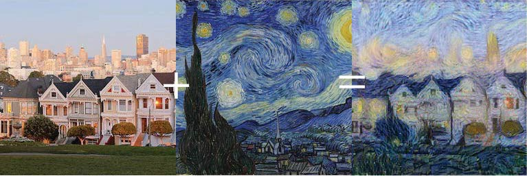

## Introduction
To quote authors Leon A. Gatys, Alexander S. Ecker, Matthias Bethge, *"in light of the striking similarities between performance-optimised artificial neural networks and biological vision, our work offers a path forward to an algorithmic understanding of how humans create and perceive artistic imagery*. 

The idea of *Neural Style Transfer* is taking a white noise as an input image, changing the input in such a way that it resembles the *content* of the content image and the *texture/artistic style* of the style image to reproduce it as a new artistic stylized image. 

We define two distances, one for the *content* that measures how different the content between the two images is, and one for *style* that measures how different the style between the two images is. The aim is to transform the white noise input such that the the content-distance and style-distance is minimized (with the content and style image respectively). 

Given below are some results from the original implementation

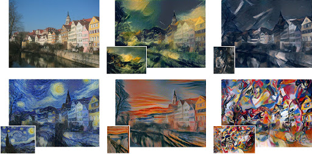

## Model Componenets

Our Model architecture follows:
- We have one module defining two classes responsible for calculating the loss functions for both content and style images and one for applying normalization on the desired values.
- We have a second module which has three methods under one class NST -
  -  A method for image preprocessing.
  -  Content and Style Model Representation - We used the feature space provided by the 16 convolutional and 5 pooling layers of the VGG-19 Network. The five    style reconstructions were generated by matching the style representations on layer 'conv1_1', 'conv2_1', 'conv3_1', 'conv4_1' and 'conv5_1. The generated style was matched with the content representation on layer 'conv4_2' to transform our input white noise into an image that applied the artistic style from the style image to the content of the content image by minimizing the values for both content and style loss respectively.
  -  A method for training - We made a third method that calls the above methods to take content and style inputs from the user, preprocesses it and runs the neural style transfer algorithm on a white noise input image for 300 iterations using the LBFGS as the optimization function to output the generated image that is a combination of the given content and style images.

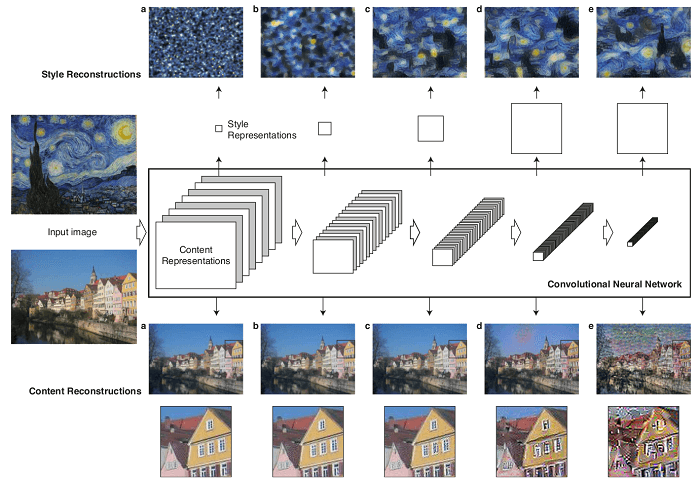

## Implementation Details
 - PIL images have values between 0 and 255, but when transformed into torch tensors, their values are converted to be between 0 and 1. The images need to be resized to have the same dimensions. Neural networks from the torch library are trained with tensor values ranging from 0 to 1. The image_loader() function takes content and style image paths and loads them, creates a white noise input image, and returns the three tensors.
 - The style_model_and_losses() function is responsible for calculating and returning the content and style losses, and adding the content loss and style loss layers immediately after the convolution layer they are detecting.
 - To quote the authors, *"To generate the images that mix the content of a photograph with the style of a painting we jointly minimise the distance of a white noise image from the content representation of the photograph in one layer of the network and the style representation of the painting in a number of layers of the CNN"*. The run_nst() function performs the neural transfer. For each iteration of the networks, an updated input is fed into it and new losses are computed. The backward methods of each loss module is run to dynamicaly compute their gradients. The optimizer requires a “closure()” function, to re-evaluate the module and return the loss.

**Note** - Owing to computational power limitations, the content and style images are resized to 512x512 when using a GPU or 128x128 when on a CPU. It is advisable to use a GPU for training because Neural Atyle Transfer is computationally very expensive.

## Usage Guidelines

- Cloning the Repository: 

        git clone https://github.com/srijarkoroy/ArtiStyle
        
- Entering the directory: 

        cd ArtiStyle
        
- Setting up the Python Environment with dependencies:

        pip install -r requirements.txt

- Running the file:

        python3 test.py
        
**Note**: Before running the test file please ensure that you mention a valid path to a content and style image and also set path='path to save the output image' if you want to save your image

Check out the demo notebook <a href = 'https://github.com/srijarkoroy/ArtiStyle/blob/main/demo/demo_nb.ipynb'>here</a>.

## Results from implementation

Content Image | Style Image | Output Image |
:-------------: | :---------: | :-----: |
| | 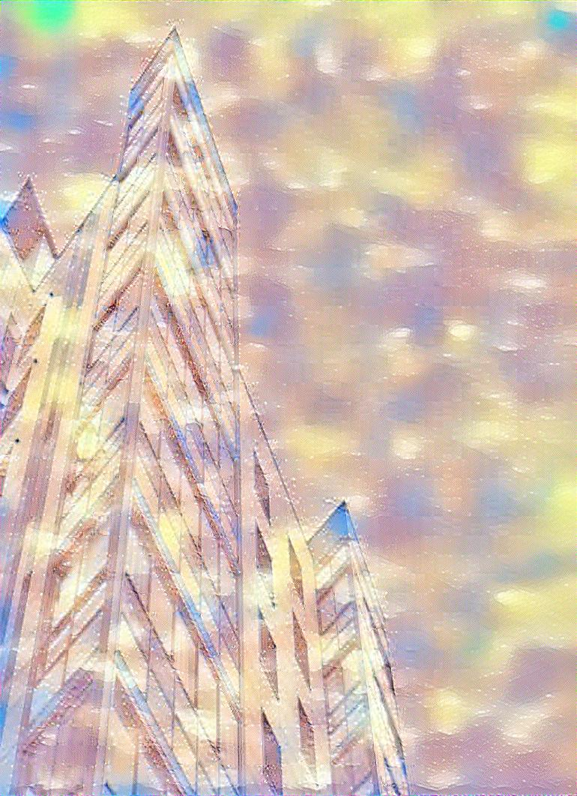 |
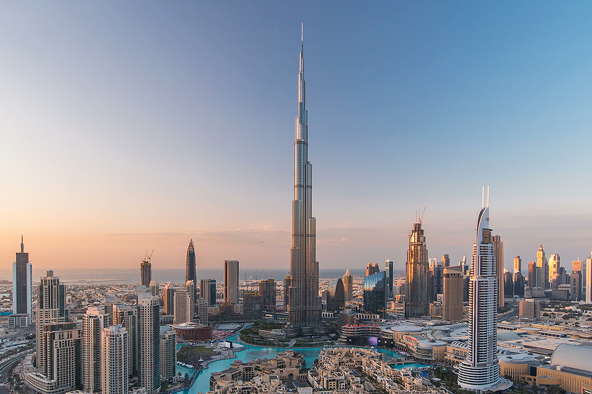| | 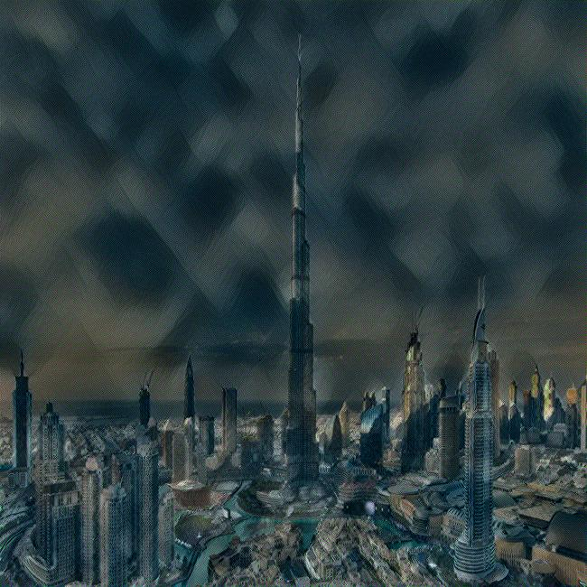 |
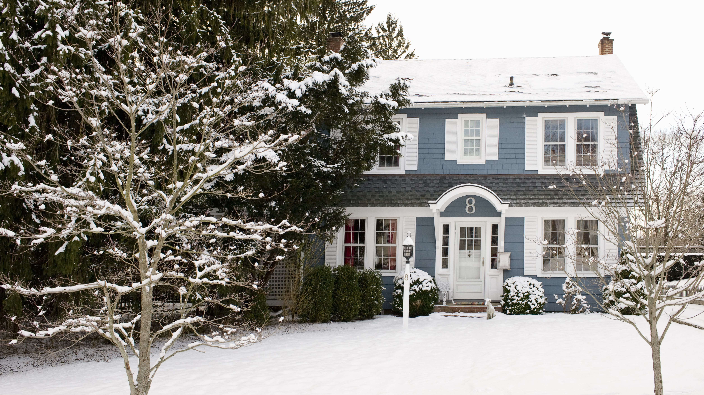| | 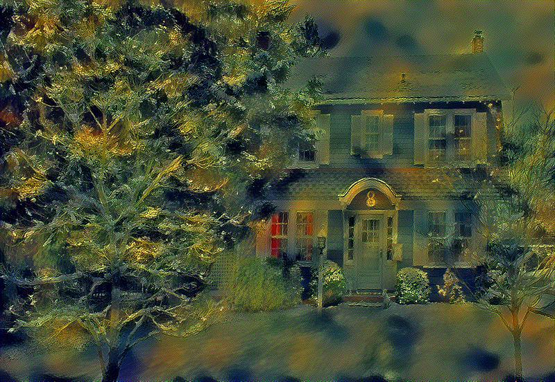 |
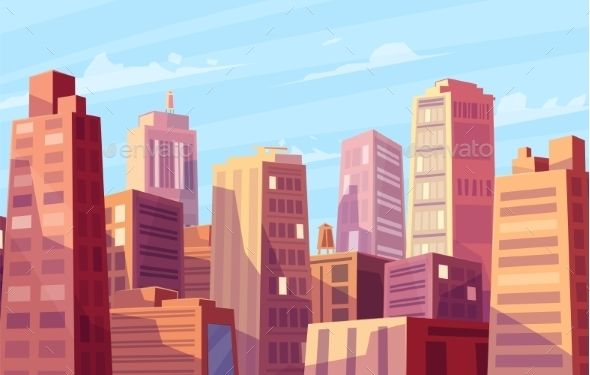| | 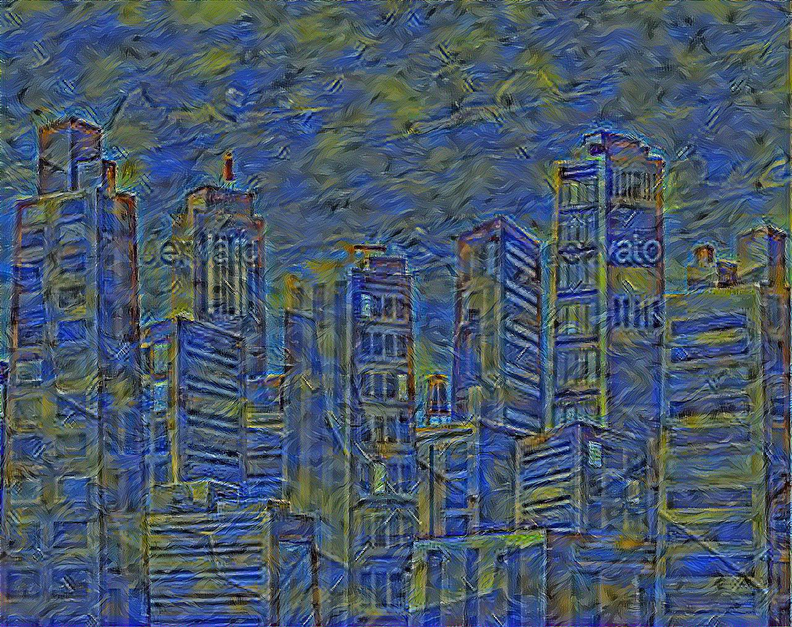 |
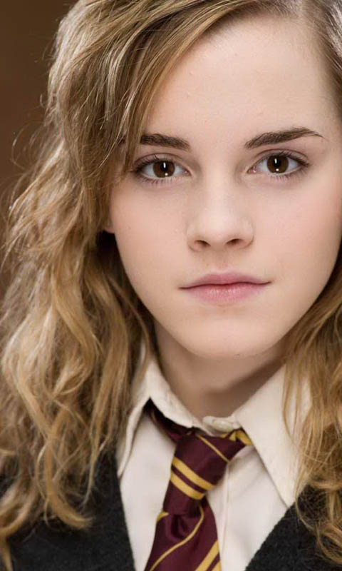| 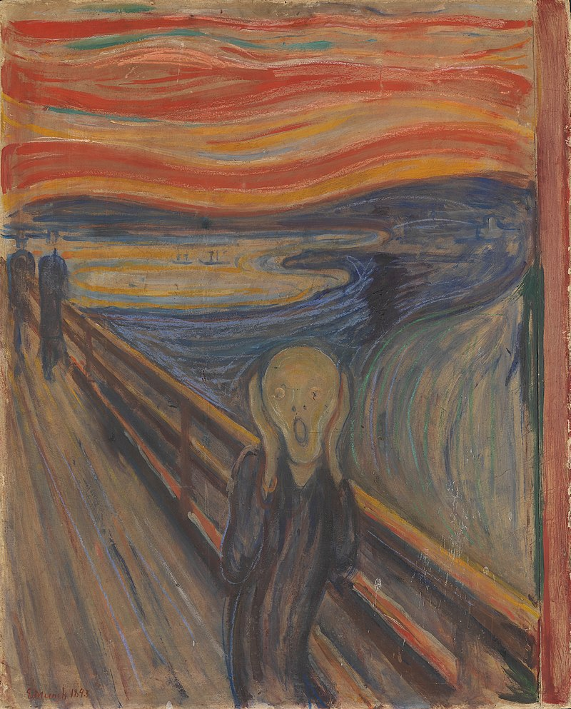| 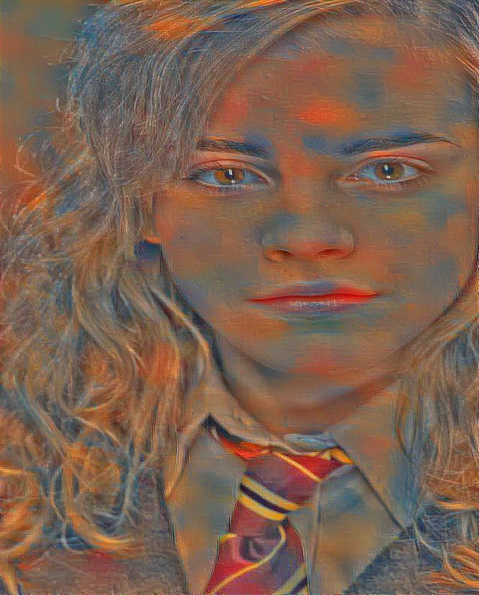 |
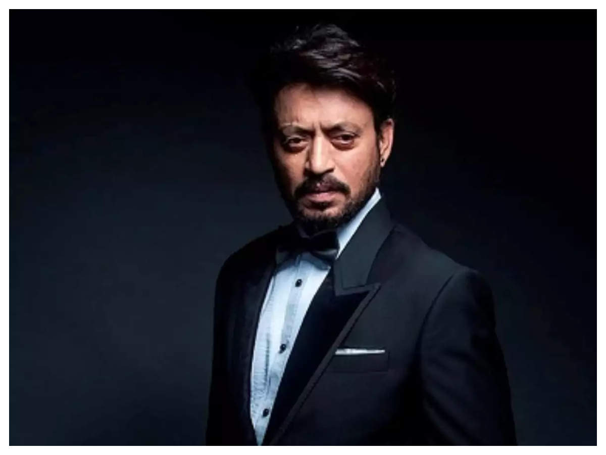| 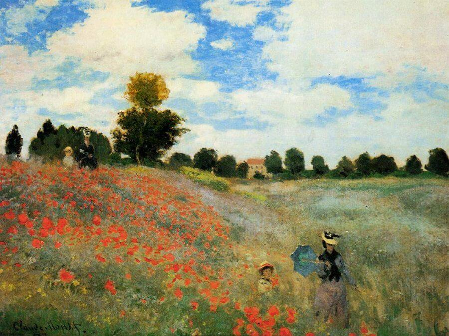| 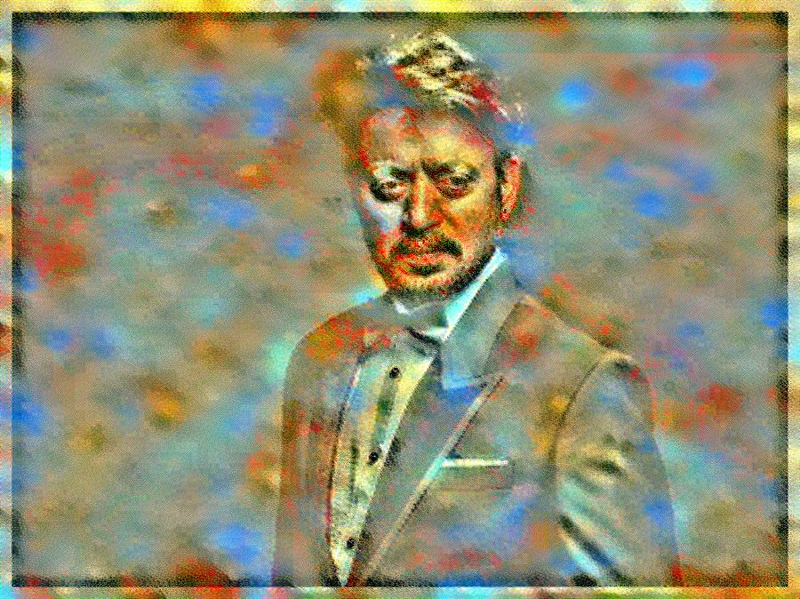 |
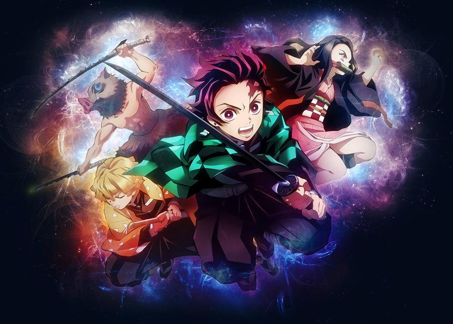| 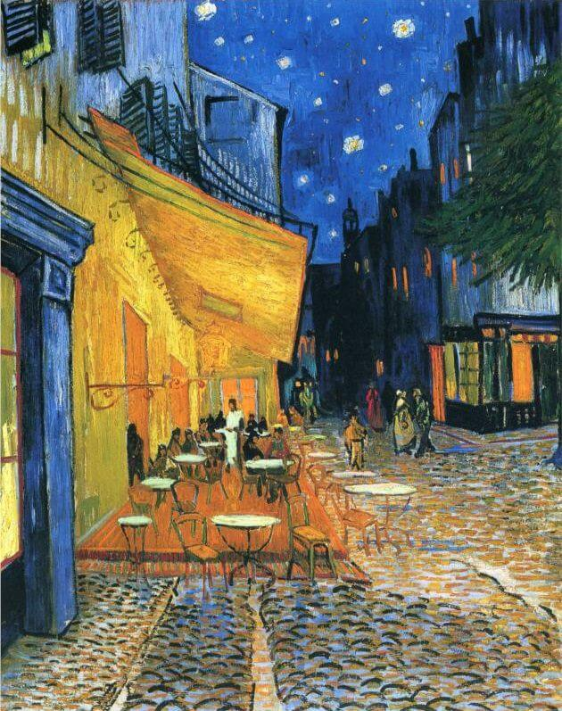| 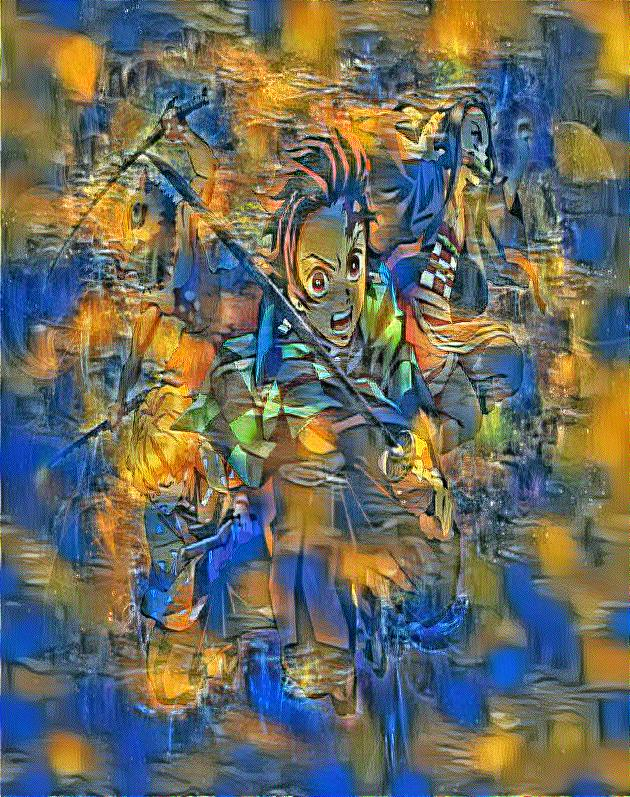 |

## Contributors

- <a href = "https://github.com/srijarkoroy">Srijarko Roy</a>
- <a href = "https://github.com/indiradutta">Indira Dutta</a>
